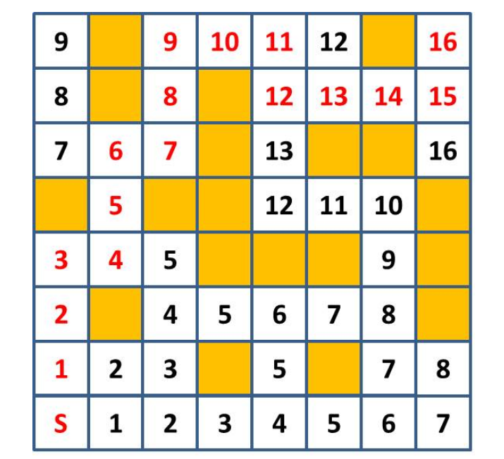

# 1.1

猜年齡，若 A 小姐超過 20 歲且不到 36 歲，請就每個年齡，求出利用二元搜尋法猜出年齡的流程。

| A 小姐的年齡 | 第一次 | 第二次 | 第三次 | 第四次 |
| -- | -- | -- | -- | -- |
| 20 | 滿 30 嗎，否 | 滿 25 嗎，否 | 滿 21 嗎，否 | 是 20 嗎，是 |
| 21 | 滿 30 嗎，否 | 滿 25 嗎，否 | 滿 21 嗎，是 | 是 21 嗎，是 |
| 22 | 滿 30 嗎，否 | 滿 25 嗎，否 | 滿 21 嗎，是 | 是 22 嗎，是 |

...

# 1.2

猜年齡遊戲，A 小姐「超過 0 歲且不到 100 歲」，有 100 個可能，可透過 6 次「Yes No 問答」就猜出答案嗎？或是有可能詢問 7 次就一定猜得出來？

6 次提問求出最多 `2^6 = 64` 種可能，7 次提問 `2^7 = 128` 種可能。所以如果 6 次求不出答案，在第 7 次能求得。

1.1 由此可套用此結論。

# 1.3

求圖 1.3 左側蟲食草的解。

```plain
  2 7
x 3 5
------
1 3 5
8 1
------
9 4 5
```

# 1.4

求圖 1.3 右側蟲食草的解。

```plain
        6 6 6 6 6 6
x           1 7 1 1
---------------------
        6 6 6 6 6 6
      6 6 6 6 6 6
  4 6 6 6 6 6 2
  6 6 6 6 6 6
---------------------
1 1 4 0 6 6 5 5 2 6
```

# 1.5

討論在圖 1.6 迷宮已知數值下，如何實際還原出從 S 到 G 的最短路線？



G 為終點，最少步數 16 步，因此可以沿著周圍 -1 步數的格子走，一路走回起點 S。

# 1.6

選一種喜歡的演算法，應用在現實生活中，並且舉例說明。

配對演算法，將資料建立關聯，例如從全校門禁紀錄中找到人群高峰時段與建築物的關聯。